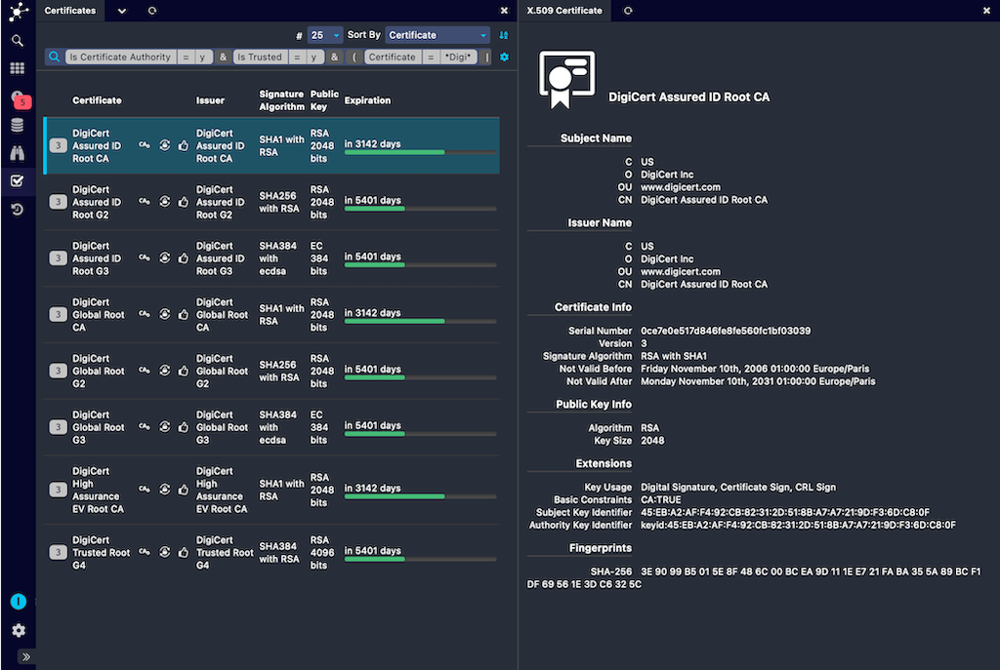

# Icinga X.509 Module

The X.509 module for Icinga keeps track of certificates as they are deployed in a network environment.
It does this by scanning networks for TLS services and collects whatever certificates it finds along the way.
The certificates are verified using its own trust store.

The module’s web frontend can be used to view scan results, allowing you to drill down into detailed information
about any discovered certificate of your landscape:

At a glance you see which CAs have issued your certificates and key counters of your environment:

## Documentation

* [Installation](doc/02-Installation.md)
* [Configuration](doc/03-Configuration.md)
* [Monitoring](doc/10-Monitoring.md)
