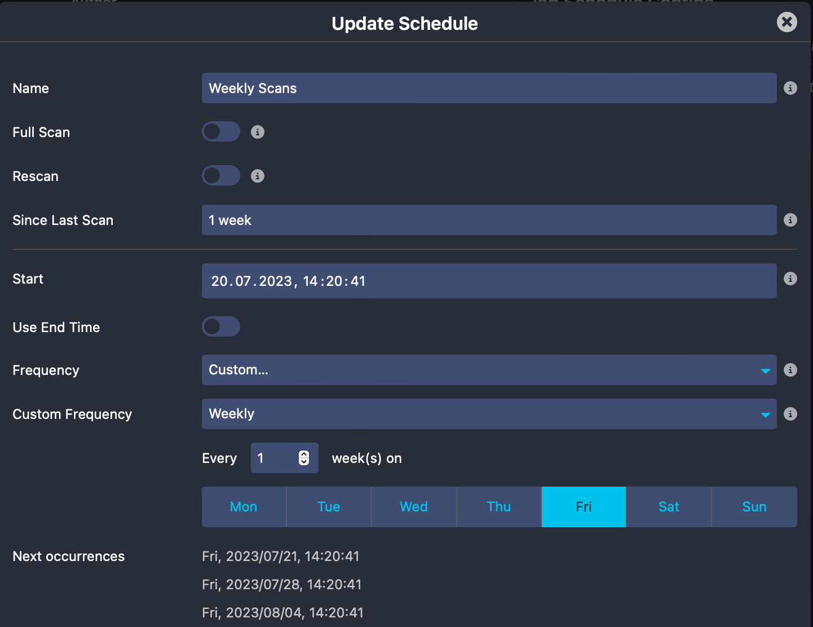

# <a id="Configuration"></a>Configuration

## Importing CA certificates

The module tries to verify certificates using its own trust store. By default, this trust store is empty, and it
is up to the Icinga Web 2 admin to import CA certificates into it.

Using the `icingacli x509 import` command CA certificates can be imported. The certificate chain file that is specified
with the `--file` option should contain a PEM-encoded list of X.509 certificates which should be added to the trust
store:

```
icingacli x509 import --file /etc/ssl/certs/ca-certificates.crt
```

## Configure Jobs

Scan jobs have a name which uniquely identifies them, e.g. `lan`. These names are used by the CLI command to start
scanning for specific jobs.

Each scan job can have one or more IP address ranges and one or more port ranges. The module scans each port in
a job's port ranges for all the individual IP addresses in the IP ranges. IP address ranges have to be specified using
the CIDR format. Multiple IP address ranges can be separated with commas, e.g.:

`192.0.2.0/24,10.0.10.0/24`

Port ranges are separated with dashes (`-`). If you only want to scan a single port you don't need to specify the second
port:

`443,5665-5669`

Additionally, each job may also exclude specific **hosts** and **IP** addresses from scan. These hosts won't be scanned
when you run the [scan](04-Scanning.md#scan-command) or [jobs](04-Scanning.md#scheduling-jobs) command. Excluding an entire network and specifying IP addresses in CIDR
format will not work. You must specify concrete **IP**s and **host CN**s separated with commas, e.g:

`192.0.2.2,192.0.2.5,icinga.com`

### Job Schedules

Schedules are [`cron`](https://crontab.guru) and rule based configs used to run jobs periodically at the given interval.
Every job is allowed to have multiple schedules that can be run independently of each other. Each job schedule provides
different options that you can use to control the scheduling behavior of the [jobs command](04-Scanning.md#scheduling-jobs).

#### Examples

A schedule that runs weekly on **Friday** and scans all targets that have not yet been scanned, or
whose last scan is older than `1 week`.



## Server Name Indication

In case you are serving multiple virtual hosts under a single IP you can configure those in
`Configuration -> Modules -> x509 -> SNI`.

Each entry defines an IP with multiple hostnames associated with it. These are then utilized when jobs run.

Modules may also provide sources for SNI. At this time the module monitoring is the only one with known support.
