# <a id="Monitoring"></a>Monitoring

## Host Check Command

The module provides a CLI command to check a host's certificate. It does so by
fetching all the necessary information from this module's own database.

### Usage

General: `icingacli x509 check host [options]`

Options:

```
--ip                   A hosts IP address
--host                 A hosts name
--port                 The port to check in particular
--warning              Less remaining time results in state WARNING [25%]
--critical             Less remaining time results in state CRITICAL [10%]
--allow-self-signed    Ignore if a certificate or its issuer has been self-signed
```

### Threshold Definition

Thresholds can either be defined relative (in percent) or absolute (time interval).
Time intervals consist of a digit and an accompanying unit (e.g. "3M" are three
months). Supported units are:

 Identifier | Description
------------|------------
y, Y        | Year
M           | Month
d, D        | Day
h, H        | Hour
m           | Minute
s, S        | Second

**Example:**

```
$ icingacli x509 check host --host example.org --warning 1y
WARNING - *.example.org expires in 219 days|'*.example.org'=18985010s;25574400;10281600;0;102470399
```

### Performance Data

The command outputs a performance data value for each certificate that is
served by the host. The value measured is the amount of seconds remaining
until the certificate expires.

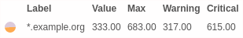

The value of `max` is the total amount of seconds the certificate is valid.
`warning` and `critical` are the seconds remaining after which the respective
state is reported.

## Icinga 2 Integration

First off, this chapter relies on the fact that you're using the Director
already and that you're familiar with some of the terms and functionalities
used there.

If you don't want to use the Director, know that Icinga 2 already provides
an appropriate template for the host check command in its template library:
https://icinga.com/docs/icinga2/latest/doc/10-icinga-template-library/#x509

### Director Import Sources

The module provides two different import sources:

#### Hosts (X509)

Focuses on the hosts the module found when scanning the networks. Use this
for the most straightforward way of integrating the results into your
environment. It's also the utilized source in the example further below.

Columns provided by this source:

Name            | Description
----------------|--------------------------------------------------------------
host_name_or_ip | Default key column. This is primarily `host_name`, though if this is not unique it falls back to `host_ip` for individual results
host_ip         | A host's IP address by which it is known to this module. May be IPv4 or IPv6
host_name       | A host's name as detected by SNI or a reverse DNS lookup during the scan process
host_ports      | Separated by comma. All ports where certificates were found
host_address    | Set to `host_ip` if it is IPv4 else `null`
host_address6   | Set to `host_ip` if it is IPv6 else `null`

#### Services (X509)

While the hosts import source does not provide any details about the found
certificates this one does. This also means that this source may generate
multiple results for a single host since it focuses on the found certificates.

Use this source if you want to import service objects directly and relate them
to already existing hosts by their utilized certificates. The Director's many
utilities provided in this regard will again come in handy here.

Columns provided by this source:

Name                  | Description
----------------------|--------------------------------------------------------
host_name_ip_and_port | Default key column. This is a combination of `host_name`, `host_ip` and `host_port` in the format `name/ip:port`
host_ip               | A host's IP address by which it is known to this module. May be IPv4 or IPv6
host_name             | A host's name as detected by SNI or a reverse DNS lookup during the scan process
host_port             | A host's port where a certificate has been found
host_address          | Set to `host_ip` if it is IPv4 else `null`
host_address6         | Set to `host_ip` if it is IPv6 else `null`
cert_subject          | A certificate's common name
cert_issuer           | The issuer's common name
cert_self_signed      | Whether the certificate is self-signed (`yes` or `no`)
cert_trusted          | Whether the certificate is trusted (`yes` or `no`)
cert_valid_from       | The certificate's start time of validity (UNIX timestamp)
cert_valid_to         | The certificate's end time of validity (UNIX timestamp)
cert_fingerprint      | The certificate's fingerprint (hex-encoded)
cert_dn               | The certificate's distinguished name
cert_subject_alt_name | The certificate's alternative subject names (Comma separated pairs of `type:name`)

### Service Checks With the Hosts Import Source

This example covers the setup of service checks by using a particular host
template and suggests then two options utilizing service apply rules.

#### Preparations

Assuming the check command definition `icingacli-x509` has already been imported
you need to define a few data fields now:

Field name                       | Data type
---------------------------------|----------
certified_ports                  | Array
icingacli_x509_ip                | String
icingacli_x509_host              | String
icingacli_x509_port              | String
icingacli_x509_warning           | String
icingacli_x509_critical          | String
icingacli_x509_allow_self_signed | Boolean

Then please create a new host template with a name of your choosing. We've chosen
`x509-host`. We're also importing our base template `base-host` here which defines
all the default properties of our hosts.

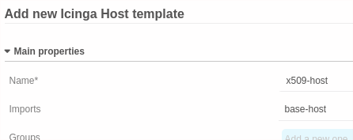

This host template also requires three data fields which are shown below.

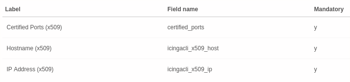

A service template is also needed. We chose the name `x509-host-check` and
`icingacli-x509` as check command.

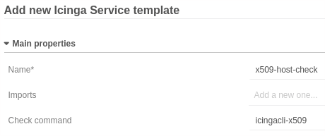

The service template now requires all data fields which correspond to the
check command's parameters.

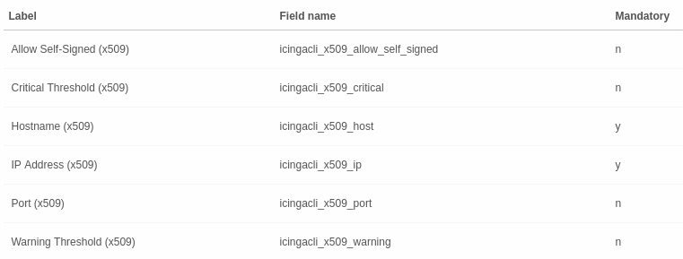

#### Import Source Setup

Create a new import source of type `Hosts (X509)`.  
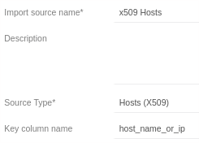

Configure a property modifier for column `host_ports` of type `Split` and use
the comma `,` as delimiter.  
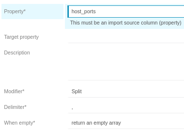

The preview should now produce a similar result to this:  
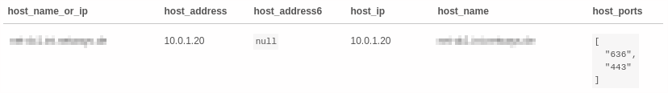

#### Sync Rule Setup

Create a new sync rule for objects of type `Host`. Depending on your environment
you may choose either `Merge` or `Replace` as update policy. Choose `Merge` to
continue with this example.

Which properties this rule defines is also very dependent on what you want to
achieve. We now assume that you already have host objects whose object names
match exactly those the import source provides. (Hence you should choose
`Merge` as update policy)

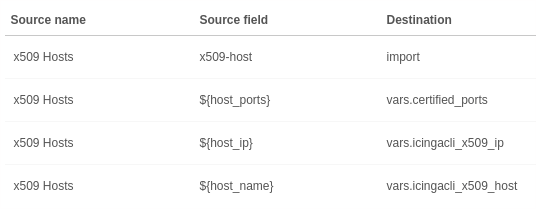

#### Service Check Setup

There are two choices now. The first checks a host's certificates as a single
service. The second creates for each individual certificate (port) a service.

##### Single Service

This is done by defining a new service as part of the host template created
earlier. There add a service and choose the service template also created
previously.


Once you've triggered the import and synchronisation as well as deployed
the resulting changes you should see this in Icinga Web 2:

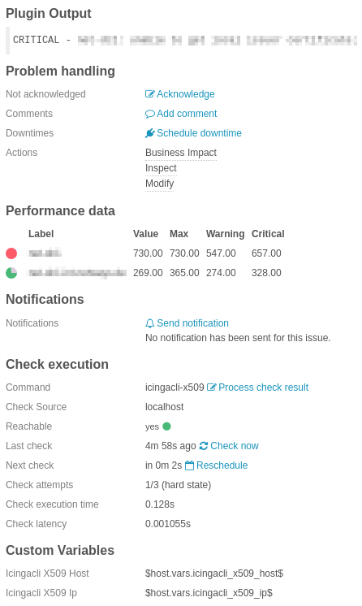

##### Multiple Services

This utilizes a service apply rule. Trigger the import and synchronisation
first, otherwise you can't choose a custom variable for the *apply for* rule.

Once the synchronisation is finished, set up the service apply rule like this:

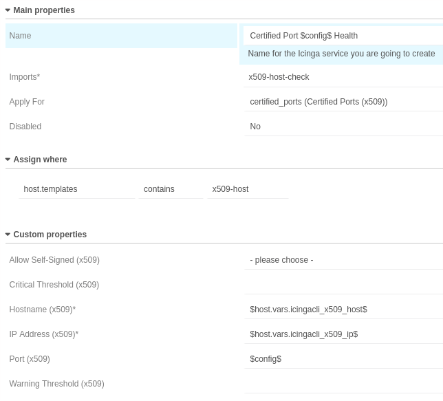

After deploying the resulting changes you should see this in Icinga Web 2:

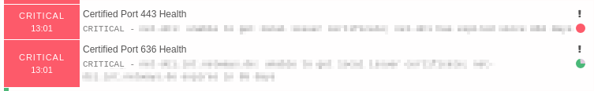
